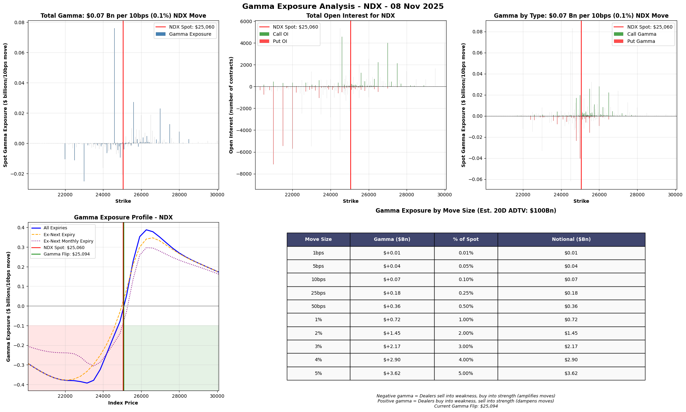
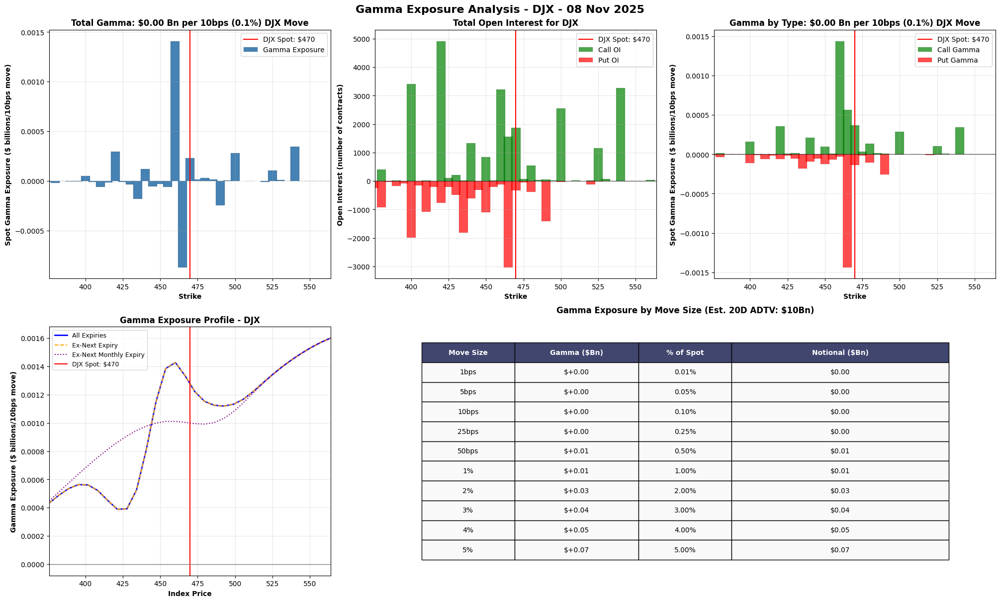
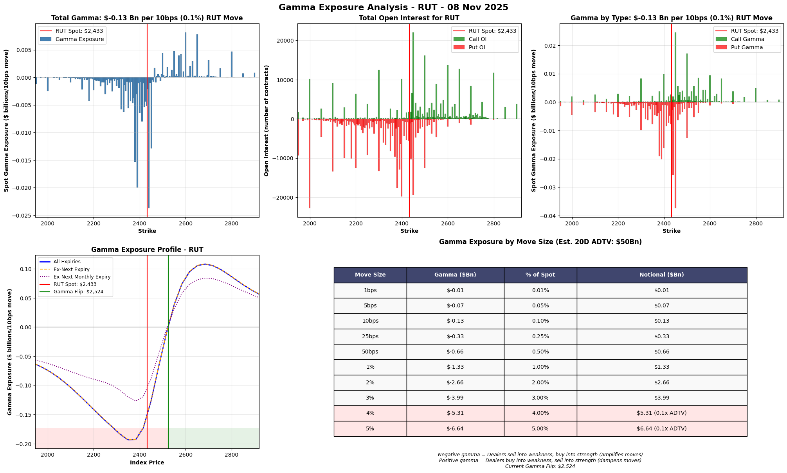
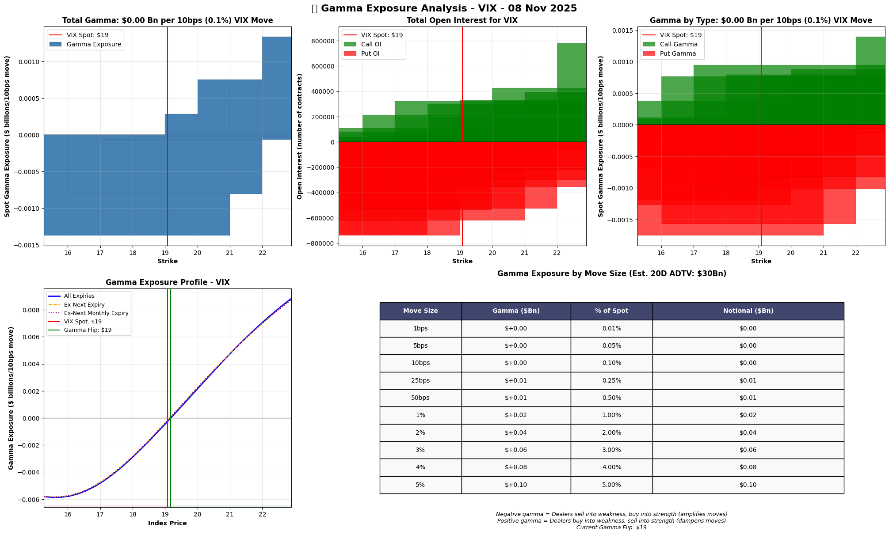
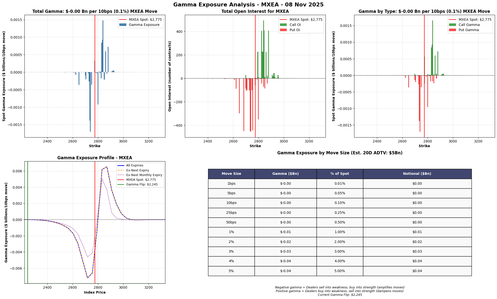
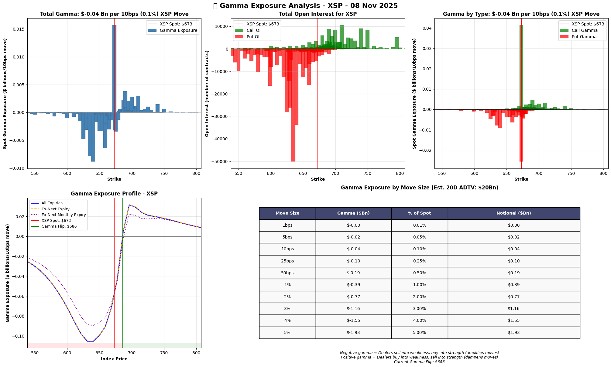
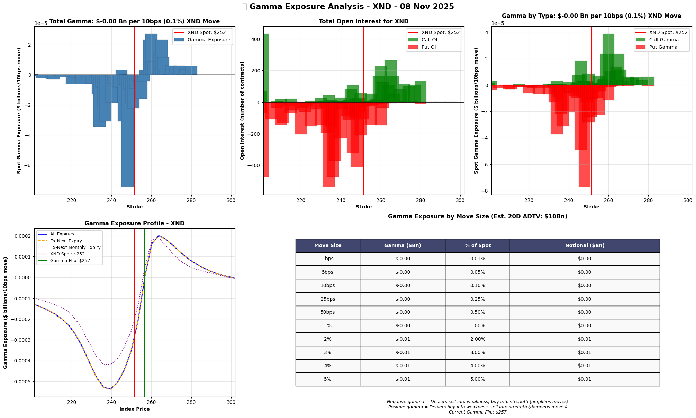
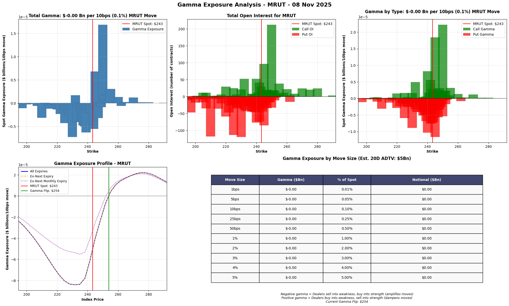

# Gamma Exposure Analysis Report

## All Available Index Tickers

### November 8, 2025

---

## Table of Contents

1. [Executive Summary](#executive-summary)
2. [S&P 500 Index (SPX)](#sp-500-index-spx)
3. [NASDAQ-100 Index (NDX)](#2-nasdaq-100-index-ndx)
4. [Dow Jones Index (DJX)](#3-dow-jones-index-djx)
5. [Russell 2000 Index (RUT)](#russell-2000-index-rut)
6. [CBOE Volatility Index (VIX)](#cboe-volatility-index-vix)
7. [MSCI EAFE Index (MXEA)](#msci-eafe-index-mxea)
8. [MSCI Emerging Markets Index (MXEF)](#msci-emerging-markets-index-mxef)
9. [Mini-SPX Index (XSP)](#mini-spx-index-xsp)
10. [Mini-NDX Index (XND)](#mini-ndx-index-xnd)
11. [Mini-Russell 2000 Index (MRUT)](#mini-russell-2000-index-mrut)

---

## Executive Summary

### Market-Wide Gamma Exposure Summary

| Index | Spot Price | Total Gamma (10bps) | Gamma Flip | Market State |
|-------|------------|-------------------|------------|--------------|
| **SPX** | $6,728.80 | **+$1.55 Bn** | $6,769.67 | **Negative Gamma** (Below Flip) |
| **NDX** | $25,059.81 | +$0.07 Bn | $25,094.45 | Negative Gamma (Below Flip) |
| **DJX** | $469.87 | +$0.001 Bn | N/A | Positive Gamma |
| **RUT** | $2,432.82 | **-$0.13 Bn** | $2,523.73 | **Strong Negative Gamma** |
| **VIX** | $19.08 | +$0.002 Bn | $19.18 | Negative Gamma (Below Flip) |
| **MXEA** | $2,774.95 | -$0.001 Bn | $2,245.13 | Positive Gamma (Above Flip) |
| **MXEF** | $1,381.63 | -$0.007 Bn | N/A | Negative Gamma |
| **XSP** | $672.88 | -$0.04 Bn | $685.78 | Strong Negative Gamma |
| **XND** | $251.56 | -$0.0003 Bn | $256.66 | Negative Gamma |
| **MRUT** | $243.28 | -$0.00005 Bn | $253.87 | Negative Gamma |

### Key Insights

1. **SPX Dominates**: S&P 500 has the largest gamma exposure at +$1.55Bn per 10bps move
2. **Mixed Market State**: Major indices showing both positive and negative gamma zones
3. **Russell 2000 Concern**: RUT shows significant negative gamma (-$0.13Bn), suggesting volatility amplification
4. **Volatility Positioning**: VIX near its gamma flip point, indicating potential regime change

---

## 1. S&P 500 Index (SPX)

### Key Metrics

- **Current Spot**: $6,728.80
- **Gamma Flip**: $6,769.67 (40.87 points above spot)
- **Total Gamma**: +$1.55 Bn per 10bps move
- **Market State**: NEGATIVE GAMMA ZONE

### Gamma Exposure by Move Size

| Move Size | Gamma Impact | Notional | % of ADTV |
|-----------|-------------|----------|-----------|
| 1bps | +$0.16 Bn | $0.16 Bn | 0.1% |
| 5bps | +$0.78 Bn | $0.78 Bn | 0.3% |
| **10bps** | **+$1.55 Bn** | **$1.55 Bn** | **0.6%** |
| 25bps | +$3.88 Bn | $3.88 Bn | 1.6% |
| 50bps | +$7.75 Bn | $7.75 Bn | 3.1% |
| 100bps (1%) | +$15.51 Bn | $15.51 Bn | 6.2% |
| 2% | +$31.02 Bn | $31.02 Bn | 12.4% |
| 3% | +$46.52 Bn | $46.52 Bn | 18.6% |
| 4% | +$62.03 Bn | $62.03 Bn | 24.8% |
| 5% | +$77.54 Bn | $77.54 Bn | **31.0% (0.3x ADTV)** |

**Analysis**: SPX is below its gamma flip point, meaning dealers amplify moves (sell weakness, buy strength). A 1% move would require $15.5Bn of hedging flows, approximately 6% of daily volume.

---

## 2. NASDAQ-100 Index (NDX)

### Key Metrics

- **Current Spot**: $25,059.81
- **Gamma Flip**: $25,094.45 (34.64 points above spot)
- **Total Gamma**: +$0.07 Bn per 10bps move
- **Market State**: NEGATIVE GAMMA ZONE

### Gamma Exposure by Move Size

| Move Size | Gamma Impact | Notional | % of ADTV |
|-----------|-------------|----------|-----------|
| 1bps | +$0.01 Bn | $0.01 Bn | 0.01% |
| 5bps | +$0.04 Bn | $0.04 Bn | 0.04% |
| **10bps** | **+$0.07 Bn** | **$0.07 Bn** | **0.07%** |
| 25bps | +$0.18 Bn | $0.18 Bn | 0.18% |
| 50bps | +$0.36 Bn | $0.36 Bn | 0.36% |
| 100bps (1%) | +$0.72 Bn | $0.72 Bn | 0.72% |
| 2% | +$1.45 Bn | $1.45 Bn | 1.45% |
| 3% | +$2.17 Bn | $2.17 Bn | 2.17% |
| 4% | +$2.90 Bn | $2.90 Bn | 2.90% |
| 5% | +$3.62 Bn | $3.62 Bn | 3.62% |

**Analysis**: NDX shows moderate positive gamma but is very close to its flip point. Hedging flows are relatively light compared to ADTV.

---

## 3. Dow Jones Index (DJX)

### Key Metrics

- **Current Spot**: $469.87
- **Gamma Flip**: Not Identified
- **Total Gamma**: +$0.001 Bn per 10bps move
- **Market State**: POSITIVE GAMMA

### Gamma Exposure by Move Size

| Move Size | Gamma Impact | Notional | % of ADTV |
|-----------|-------------|----------|-----------|
| 1bps | +$0.0001 Bn | $0.0001 Bn | 0.001% |
| 5bps | +$0.0007 Bn | $0.0007 Bn | 0.007% |
| **10bps** | **+$0.001 Bn** | **$0.001 Bn** | **0.01%** |
| 25bps | +$0.003 Bn | $0.003 Bn | 0.03% |
| 50bps | +$0.007 Bn | $0.007 Bn | 0.07% |
| 100bps (1%) | +$0.013 Bn | $0.013 Bn | 0.13% |
| 2% | +$0.027 Bn | $0.027 Bn | 0.27% |
| 3% | +$0.040 Bn | $0.040 Bn | 0.40% |
| 4% | +$0.054 Bn | $0.054 Bn | 0.54% |
| 5% | +$0.067 Bn | $0.067 Bn | 0.67% |

**Analysis**: DJX has minimal gamma exposure with stable positive gamma throughout, providing slight volatility dampening.

---

## 4. Russell 2000 Index (RUT)

### Key Metrics

- **Current Spot**: $2,432.82
- **Gamma Flip**: $2,523.73 (90.91 points above spot)
- **Total Gamma**: **-$0.13 Bn per 10bps move**
- **Market State**: **STRONG NEGATIVE GAMMA ZONE**

### Gamma Exposure by Move Size

| Move Size | Gamma Impact | Notional | % of ADTV |
|-----------|-------------|----------|-----------|
| 1bps | -$0.01 Bn | $0.01 Bn | 0.03% |
| 5bps | -$0.07 Bn | $0.07 Bn | 0.13% |
| **10bps** | **-$0.13 Bn** | **$0.13 Bn** | **0.27%** |
| 25bps | -$0.33 Bn | $0.33 Bn | 0.66% |
| 50bps | -$0.66 Bn | $0.66 Bn | 1.33% |
| 100bps (1%) | -$1.33 Bn | $1.33 Bn | 2.66% |
| 2% | -$2.66 Bn | $2.66 Bn | 5.31% |
| 3% | -$3.99 Bn | $3.99 Bn | 7.97% |
| 4% | -$5.31 Bn | $5.31 Bn | **10.63% (0.1x ADTV)** |
| 5% | -$6.64 Bn | $6.64 Bn | **13.29% (0.1x ADTV)** |

**Analysis**: RUT shows significant negative gamma, indicating strong volatility amplification. Dealers will sell into declines and buy into rallies, potentially creating sharp moves.

---

## 5. CBOE Volatility Index (VIX)

### Key Metrics

- **Current Spot**: $19.08
- **Gamma Flip**: $19.18 (0.10 points above spot)
- **Total Gamma**: +$0.002 Bn per 10bps move
- **Market State**: NEAR GAMMA FLIP POINT

### Gamma Exposure by Move Size

| Move Size | Gamma Impact | Notional | % of ADTV |
|-----------|-------------|----------|-----------|
| 1bps | +$0.0002 Bn | $0.0002 Bn | 0.001% |
| 5bps | +$0.001 Bn | $0.001 Bn | 0.003% |
| **10bps** | **+$0.002 Bn** | **$0.002 Bn** | **0.007%** |
| 25bps | +$0.005 Bn | $0.005 Bn | 0.017% |
| 50bps | +$0.010 Bn | $0.010 Bn | 0.035% |
| 100bps (1%) | +$0.021 Bn | $0.021 Bn | 0.070% |
| 2% | +$0.042 Bn | $0.042 Bn | 0.140% |
| 3% | +$0.063 Bn | $0.063 Bn | 0.209% |
| 4% | +$0.084 Bn | $0.084 Bn | 0.279% |
| 5% | +$0.105 Bn | $0.105 Bn | 0.349% |

**Analysis**: VIX is extremely close to its gamma flip point, suggesting a potential regime change in volatility dynamics with minimal movement.

---

## 6. MSCI EAFE Index (MXEA)

### Key Metrics

- **Current Spot**: $2,774.95
- **Gamma Flip**: $2,245.13 (529.82 points below spot)
- **Total Gamma**: -$0.001 Bn per 10bps move
- **Market State**: POSITIVE GAMMA ZONE (Above Flip)

### Gamma Exposure by Move Size

| Move Size | Gamma Impact | Notional | % of ADTV |
|-----------|-------------|----------|-----------|
| 1bps | -$0.0001 Bn | $0.0001 Bn | 0.002% |
| 5bps | -$0.0004 Bn | $0.0004 Bn | 0.009% |
| **10bps** | **-$0.001 Bn** | **$0.001 Bn** | **0.018%** |
| 25bps | -$0.002 Bn | $0.002 Bn | 0.045% |
| 50bps | -$0.004 Bn | $0.004 Bn | 0.089% |
| 100bps (1%) | -$0.009 Bn | $0.009 Bn | 0.179% |
| 2% | -$0.018 Bn | $0.018 Bn | 0.357% |
| 3% | -$0.027 Bn | $0.027 Bn | 0.536% |
| 4% | -$0.036 Bn | $0.036 Bn | 0.714% |
| 5% | -$0.045 Bn | $0.045 Bn | 0.893% |

**Analysis**: MXEA is well above its gamma flip point, in positive gamma territory providing volatility dampening.

---

## 7. MSCI Emerging Markets Index (MXEF)

### Key Metrics

- **Current Spot**: $1,381.63
- **Gamma Flip**: Not Identified
- **Total Gamma**: -$0.007 Bn per 10bps move
- **Market State**: NEGATIVE GAMMA

### Gamma Exposure by Move Size

| Move Size | Gamma Impact | Notional | % of ADTV |
|-----------|-------------|----------|-----------|
| 1bps | -$0.001 Bn | $0.001 Bn | 0.014% |
| 5bps | -$0.003 Bn | $0.003 Bn | 0.069% |
| **10bps** | **-$0.007 Bn** | **$0.007 Bn** | **0.138%** |
| 25bps | -$0.017 Bn | $0.017 Bn | 0.344% |
| 50bps | -$0.034 Bn | $0.034 Bn | 0.689% |
| 100bps (1%) | -$0.069 Bn | $0.069 Bn | 1.378% |
| 2% | -$0.138 Bn | $0.138 Bn | 2.756% |
| 3% | -$0.207 Bn | $0.207 Bn | 4.133% |
| 4% | -$0.276 Bn | $0.276 Bn | 5.511% |
| 5% | -$0.344 Bn | $0.344 Bn | 6.889% |

**Analysis**: MXEF shows consistent negative gamma, suggesting volatility amplification in emerging markets.

---

## 8. Mini-SPX Index (XSP)

### Key Metrics

- **Current Spot**: $672.88
- **Gamma Flip**: $685.78 (12.90 points above spot)
- **Total Gamma**: -$0.04 Bn per 10bps move
- **Market State**: NEGATIVE GAMMA ZONE

### Gamma Exposure by Move Size

| Move Size | Gamma Impact | Notional | % of ADTV |
|-----------|-------------|----------|-----------|
| 1bps | -$0.004 Bn | $0.004 Bn | 0.019% |
| 5bps | -$0.019 Bn | $0.019 Bn | 0.097% |
| **10bps** | **-$0.039 Bn** | **$0.039 Bn** | **0.193%** |
| 25bps | -$0.097 Bn | $0.097 Bn | 0.484% |
| 50bps | -$0.193 Bn | $0.193 Bn | 0.967% |
| 100bps (1%) | -$0.387 Bn | $0.387 Bn | 1.934% |
| 2% | -$0.774 Bn | $0.774 Bn | 3.868% |
| 3% | -$1.160 Bn | $1.160 Bn | 5.802% |
| 4% | -$1.547 Bn | $1.547 Bn | 7.736% |
| 5% | -$1.934 Bn | $1.934 Bn | 9.670% |

**Analysis**: Mini-SPX shows moderate negative gamma, complementing the main SPX contract with additional retail flow.

---

## 9. Mini-NDX Index (XND)

### Key Metrics

- **Current Spot**: $251.56
- **Gamma Flip**: $256.66 (5.10 points above spot)
- **Total Gamma**: -$0.0003 Bn per 10bps move
- **Market State**: NEGATIVE GAMMA ZONE

### Gamma Exposure by Move Size

| Move Size | Gamma Impact | Notional | % of ADTV |
|-----------|-------------|----------|-----------|
| 1bps | -$0.00003 Bn | $0.00003 Bn | 0.0003% |
| 5bps | -$0.0001 Bn | $0.0001 Bn | 0.001% |
| **10bps** | **-$0.0003 Bn** | **$0.0003 Bn** | **0.003%** |
| 25bps | -$0.0006 Bn | $0.0006 Bn | 0.006% |
| 50bps | -$0.001 Bn | $0.001 Bn | 0.013% |
| 100bps (1%) | -$0.003 Bn | $0.003 Bn | 0.026% |
| 2% | -$0.005 Bn | $0.005 Bn | 0.052% |
| 3% | -$0.008 Bn | $0.008 Bn | 0.077% |
| 4% | -$0.010 Bn | $0.010 Bn | 0.103% |
| 5% | -$0.013 Bn | $0.013 Bn | 0.129% |

**Analysis**: Mini-NDX has minimal gamma exposure with negligible market impact.

---

## 10. Mini-Russell 2000 Index (MRUT)

### Key Metrics

- **Current Spot**: $243.28
- **Gamma Flip**: $253.87 (10.59 points above spot)
- **Total Gamma**: -$0.00005 Bn per 10bps move
- **Market State**: NEGATIVE GAMMA ZONE

### Gamma Exposure by Move Size

| Move Size | Gamma Impact | Notional | % of ADTV |
|-----------|-------------|----------|-----------|
| 1bps | -$0.000005 Bn | $0.000005 Bn | 0.0001% |
| 5bps | -$0.00002 Bn | $0.00002 Bn | 0.0005% |
| **10bps** | **-$0.00005 Bn** | **$0.00005 Bn** | **0.001%** |
| 25bps | -$0.0001 Bn | $0.0001 Bn | 0.002% |
| 50bps | -$0.0002 Bn | $0.0002 Bn | 0.005% |
| 100bps (1%) | -$0.0005 Bn | $0.0005 Bn | 0.010% |
| 2% | -$0.001 Bn | $0.001 Bn | 0.019% |
| 3% | -$0.001 Bn | $0.001 Bn | 0.029% |
| 4% | -$0.002 Bn | $0.002 Bn | 0.039% |
| 5% | -$0.002 Bn | $0.002 Bn | 0.049% |

**Analysis**: Mini-Russell has negligible gamma exposure with minimal market impact.

---

## Market-Wide Conclusions

### Current Market Positioning

1. **SPX Dominance**: The S&P 500 represents the vast majority of index gamma exposure at +$1.55Bn per 10bps
2. **Negative Gamma Environment**: Most major indices (SPX, NDX, RUT) are below their gamma flip points
3. **Volatility Amplification Expected**: Negative gamma positioning suggests dealers will amplify moves

### Risk Considerations

- **Large Move Risk**: A 2% move in SPX would trigger $31Bn in hedging flows (12.4% of ADTV)
- **Russell 2000 Vulnerability**: RUT's strong negative gamma suggests heightened small-cap volatility
- **VIX Regime Change**: VIX is precisely at its flip point - watch for volatility regime shifts

### Trading Implications

- **Intraday Volatility**: Expect amplified intraday moves, especially in SPX and RUT
- **Support/Resistance**: Gamma flip levels act as key technical levels
- **Options Pinning**: High open interest strikes may act as magnets near expiration

---

*Report Generated: November 8, 2025*
*Data Source: CBOE Delayed Quotes API (15-minute delay)*
*Charts Location: ./charts/ directory*
