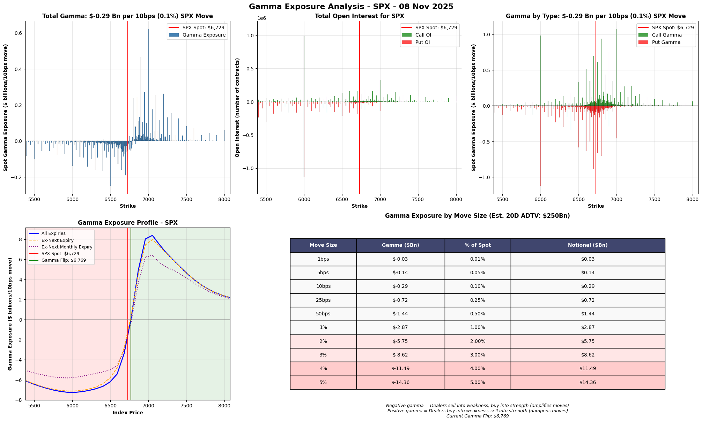

# Gamma Exposure (GEX) Analytics 📊

[](https://www.python.org/)
[](LICENSE)
[](https://www.cboe.com/)
[](https://github.com/astral-sh/uv)

> Real-time options market gamma exposure analysis for major indices - identify dealer hedging flows and key support/resistance levels

## 🚀 Quick Start

```bash
# Clone the repository
git clone https://github.com/pikki622/gex-analytics.git
cd gex-analytics

# Install dependencies with uv
uv sync

# Run gamma analysis for S&P 500
uv run python gammaProfileCommandLine10bps.py SPX
```

## 📊 What This Tool Does

Analyzes options market gamma exposure to reveal:
- 🎯 **Gamma flip points** - Where dealer hedging behavior reverses
- 📈 **Support/Resistance levels** - Based on options positioning
- ⚡ **Volatility forecasts** - Whether dealers amplify or dampen moves
- 💰 **Hedging flow estimates** - Dollar amounts dealers must trade

## 📋 Table of Contents
- [Features](#features)
- [How It Works](#how-it-works)
- [Installation](#installation)
- [Usage](#usage)
- [Available Tickers](#available-tickers)
- [Output Charts](#output-charts)
- [Interpretation Guide](#interpretation-guide)
- [📚 Terminology Guide](docs/terminology.md)
- [Development Roadmap](#development-roadmap)
- [Contributing](#contributing)

## ✨ Features

### Current Capabilities
- ✅ **10 Major Indices** - SPX, NDX, RUT, VIX, and more
- ✅ **Real-time Data** - 15-minute delayed quotes from CBOE
- ✅ **Two Analysis Modes** - 1% moves or precise 10bps moves
- ✅ **5-Panel Visualization** - Comprehensive gamma analysis charts
- ✅ **ADTV Context** - Hedging flows relative to daily volume
- ✅ **Batch Processing** - Generate reports for all indices at once

### Coming Soon (See [Roadmap](IMPLEMENTATION_PLAN.md))
- 🔄 Visual hierarchy with risk indicators
- 🔄 Trade setup recommendations
- 🔄 Historical gamma tracking
- 🔄 Cross-index correlation analysis

## How It Works

This tool fetches real-time options data from CBOE (Chicago Board Options Exchange) and calculates the gamma exposure of market makers at different price levels. This helps identify:
- Where market makers need to hedge (buy/sell underlying)
- Potential support and resistance levels
- The "gamma flip" point where hedging behavior changes

### Workflow

1. **Data Fetching** (lines 32-34)
   - Connects to CBOE's delayed quotes API
   - Downloads complete options chain for the specified index
   - Extracts current spot price

2. **Data Processing** (lines 46-87)
   - Parses option symbols to extract strike prices and expiration dates
   - Separates calls and puts
   - Merges data into a unified DataFrame
   - Converts data types for calculations

3. **Gamma Calculations** (lines 90-98)
   - Calculates spot gamma exposure for each strike
   - Formula: `GEX = Unit Gamma × Open Interest × 100 × Spot² × 0.01`
   - Puts have negative gamma exposure (market makers are short puts)

4. **Gamma Profile Generation** (lines 138-173)
   - Simulates gamma at different spot prices
   - Uses Black-Scholes model for theoretical gamma values
   - Identifies the "gamma flip" point (zero gamma crossing)

5. **Visualization** (lines 100-206)
   - Generates 4 interactive charts showing different aspects of gamma exposure

## Key Concepts

### Gamma Exposure (GEX)
Gamma exposure represents the amount of shares market makers must buy or sell to maintain delta neutrality when the underlying price moves 1%.

- **Positive Gamma**: Market makers dampen volatility (buy dips, sell rallies)
- **Negative Gamma**: Market makers amplify volatility (sell dips, buy rallies)
- **Zero Gamma (Flip Point)**: Transition between stabilizing and destabilizing hedging flows

### Black-Scholes Gamma Calculation
The `calcGammaEx` function (lines 13-25) implements the Black-Scholes gamma formula:

```python
gamma = exp(-q*T) * norm.pdf(d1) / (S * vol * sqrt(T))
```

Where:
- `S`: Spot price
- `K`: Strike price
- `vol`: Implied volatility
- `T`: Time to expiration
- `r`: Risk-free rate (set to 0)
- `q`: Dividend yield (set to 0)

### Days to Expiration Handling
- Business days are calculated excluding weekends (line 142-143)
- 0DTE options are set to 1/262 year to avoid division by zero
- Monthly options are identified by third Friday detection (lines 27-29, 147-149)

## Code Architecture

### Main Components

1. **Option Greeks Calculator** (`calcGammaEx`)
   - Pure Black-Scholes implementation
   - Handles edge cases (zero time/volatility)
   - Returns dollar gamma exposure

2. **Data Parser**
   - Extracts components from CBOE option symbols
   - Format: `INDEX YYMMDD C/P STRIKE`
   - Example: `SPX241108C05500` = SPX Nov 8, 2024 Call at 5500

3. **Aggregation Engine**
   - Groups by strike price
   - Sums total gamma across all expirations
   - Handles "ex-next expiry" calculations

4. **Visualization Module**
   - 4 distinct chart types
   - Interactive matplotlib plots
   - Color-coded regions (red = negative gamma, green = positive)

## Available Tickers

The tool works with CBOE-listed index options through their free API. ETF options require a paid subscription.

### ✅ Working Tickers (Free Access)

| Ticker | Description | Current Spot Price |
|--------|-------------|-------------------|
| **SPX** | S&P 500 Index | ~$6,728 |
| **NDX** | NASDAQ-100 Index | ~$25,059 |
| **DJX** | Dow Jones Index (1/100th scale) | ~$469 |
| **RUT** | Russell 2000 Index | ~$2,432 |
| **VIX** | CBOE Volatility Index | ~$19 |
| **MXEA** | MSCI EAFE Index | ~$2,774 |
| **MXEF** | MSCI Emerging Markets Index | ~$1,381 |
| **XSP** | Mini-SPX Index (1/10th SPX) | ~$672 |
| **XND** | Mini-NDX Index (1/100th NDX) | ~$251 |
| **MRUT** | Mini-Russell 2000 Index (1/10th RUT) | ~$243 |

### ❌ Unavailable Without Subscription

ETF options (SPY, QQQ, IWM, etc.) return HTTP 403 errors and require a CBOE DataShop subscription ($380-2000+/month).

## 📦 Installation

### Prerequisites
- Python 3.8 or higher
- [uv package manager](https://github.com/astral-sh/uv) (recommended) or pip

### Option 1: Using uv (Recommended)
```bash
# Install uv if you haven't already
curl -LsSf https://astral.sh/uv/install.sh | sh

# Clone and setup
git clone https://github.com/pikki622/gex-analytics.git
cd gex-analytics
uv sync
```

### Option 2: Using pip
```bash
# Clone repository
git clone https://github.com/pikki622/gex-analytics.git
cd gex-analytics

# Create virtual environment
python -m venv venv
source venv/bin/activate  # On Windows: venv\Scripts\activate

# Install dependencies
pip install pandas numpy scipy matplotlib requests
```

## 🎯 Usage

### Quick Examples

```bash
# Analyze S&P 500 with 10bps precision (recommended)
uv run python gammaProfileCommandLine10bps.py SPX

# Generate comprehensive report for all indices
uv run python generate_all_charts.py

# Test which tickers are available
uv run python test_tickers.py
```

### Available Scripts

| Script | Description | Use Case |
|--------|-------------|----------|
| `gammaProfileCommandLine10bps.py` | **Recommended** - 10bps precision with grid layout | Daily analysis |
| `gammaProfileCommandLine.py` | Original 1% move analysis | Quick checks |
| `generate_all_charts.py` | Batch process all indices | Full market scan |
| `test_tickers.py` | Check ticker availability | Troubleshooting |

### Example Commands

```bash
# Analyze S&P 500 gamma (1% moves)
uv run python gammaProfileCommandLine.py SPX

# Analyze NASDAQ-100 gamma (10bps moves, grid view)
uv run python gammaProfileCommandLine10bps.py NDX

# Test all available tickers
uv run python test_tickers.py
```

## 📊 Example Output

The tool generates a comprehensive 5-panel analysis (10bps version includes ADTV table):



*Example output for S&P 500 showing gamma exposure, open interest distribution, and flip points*

## Output Charts

The tool generates 5 comprehensive visualizations:

### Chart 1: Total Gamma Exposure
- Bar chart showing net gamma at each strike price
- Helps identify key support/resistance levels
- Positive bars = net long gamma, Negative = net short gamma

### Chart 2: Open Interest Distribution
- Shows call OI above zero, put OI below zero
- Identifies where most options positions are concentrated
- Large OI strikes often act as "magnets" for price

### Chart 3: Gamma by Type (Calls vs Puts)
- Separates call gamma (positive) from put gamma (negative)
- Shows which side dominates at each strike
- Useful for understanding directional hedging flows

### Chart 4: Gamma Exposure Profile
- Line chart showing gamma across different spot prices
- Identifies the "gamma flip" point (zero crossing)
- Shows ex-next expiry and ex-monthly expiry profiles
- Red shading = negative gamma zone (volatility amplifying)
- Green shading = positive gamma zone (volatility dampening)

### Chart 5: Gamma Impact Table (10bps version)
- Shows gamma exposure for different move sizes (1-500bps)
- Contextualizes hedging flows vs 20-day ADTV
- Highlights when flows exceed 10% of daily volume
- Critical for understanding market impact potential

## Interpretation Guide

### 🆕 New to Options?
Check out our comprehensive guides:
- [**Terminology Guide**](docs/terminology.md) - Plain English explanations of all terms
- [**FAQ**](docs/FAQ.md) - Quick answers to common questions
- Real-world examples and decision trees
- Trading strategies based on gamma state

### Key Metrics
- **Total Gamma**: Net $ exposure market makers must hedge per 1% or 0.1% move
- **Gamma Flip**: Price where market maker hedging behavior reverses
- **Negative Gamma**: Below flip point, dealers sell into weakness, buy into strength
- **Positive Gamma**: Above flip point, dealers buy into weakness, sell into strength

### Trading Implications
- Large positive gamma = Lower volatility expected (dampening effect)
- Large negative gamma = Higher volatility expected (amplifying effect)
- Gamma flip point often acts as pivot level for intraday price action
- High OI strikes can act as support/resistance due to pinning effects

## Requirements

- Python 3.8+
- pandas, numpy, scipy, matplotlib, requests
- uv package manager (recommended) or pip

## Data Source

Options data is sourced from CBOE's delayed quotes API (15-minute delay). Real-time data requires CBOE subscription.

## 🗺️ Development Roadmap

See [IMPLEMENTATION_PLAN.md](IMPLEMENTATION_PLAN.md) for the detailed roadmap. Key upcoming features:

### Phase 1 (In Progress)
- ✅ Documentation improvements
- 🔄 Visual hierarchy with risk indicators
- 🔄 Glossary and terminology guide

### Phase 2 (Next Week)
- Trade setup recommendations
- Scenario analysis engine
- Risk management guidelines

### Phase 3 (Future)
- Historical gamma tracking
- Enhanced visualizations
- Cross-index correlation analysis

## 🤝 Contributing

We welcome contributions! Here's how to get started:

1. Fork the repository
2. Create a feature branch (`git checkout -b feature/amazing-feature`)
3. Make your changes
4. Run tests (when available)
5. Commit with descriptive message (`git commit -m 'Add amazing feature'`)
6. Push to your branch (`git push origin feature/amazing-feature`)
7. Open a Pull Request

Please use the PR template and follow the coding standards in [IMPLEMENTATION_PLAN.md](IMPLEMENTATION_PLAN.md#review-checklist-for-each-pr).

## 📄 License

This project is licensed under the MIT License - see the [LICENSE](LICENSE) file for details.

## 🙏 Acknowledgments

- CBOE for providing options data API
- The options trading community for gamma exposure concepts
- Contributors and users providing feedback

## 📧 Contact

- GitHub Issues: [Report bugs or request features](https://github.com/pikki622/gex-analytics/issues)
- Repository: [github.com/pikki622/gex-analytics](https://github.com/pikki622/gex-analytics)

---

*If you find this tool useful, please ⭐ the repository!*